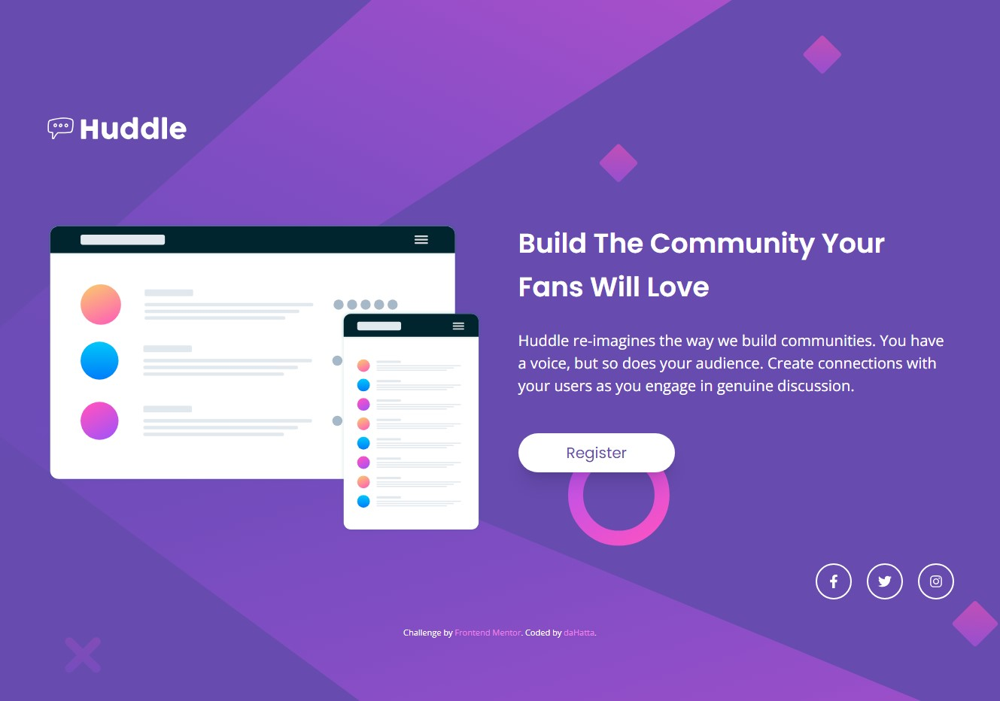

# Frontend Mentor - Huddle landing page with single introductory section solution

This is my solution to the [Huddle landing page with single introductory section challenge on Frontend Mentor](https://www.frontendmentor.io/challenges/huddle-landing-page-with-a-single-introductory-section-B_2Wvxgi0).

## Table of contents

- [Overview](#overview)
  - [The challenge](#the-challenge)
  - [Screenshot](#screenshot)
  - [Links](#links)
- [My process](#my-process)
  - [Built with](#built-with)
  - [What I learned](#what-i-learned)
  - [Continued development](#continued-development)
  - [Useful resources](#useful-resources)
- [Author](#author)

## Overview

### The challenge

Users should be able to:

- View the optimal layout for the page depending on their device's screen size
- See hover states for all interactive elements on the page

### Screenshot



### Links

- Solution URL: [https://github.com/daHatta/fem-huddle-landing-page-single-intro](https://github.com/daHatta/fem-huddle-landing-page-single-intro)
- Live Site URL: [https://fem-huddle-landing-page-single-intro.vercel.app/](https://fem-huddle-landing-page-single-intro.vercel.app/)

## My process

### Built with

- Semantic HTML5 markup
- CSS custom properties
- Flexbox
- CSS Grid
- Mobile-first workflow
- [React](https://reactjs.org/) - JS library
- [Next.js](https://nextjs.org/) - React framework
- [Tailwind CSS](https://tailwindcss.com/) - For styles

### What I learned

Using Tailwind CSS for the first time on an own project, I learned some basics about setting up a theme
via the _tailwind.config.ts_ file. You are able to setup e.g. the colors and screen sizes:

```js
// ...
theme: {
  screens: {
    "xs": "375px",
    "sm": "750px",
    "md": "960px",
    "lg": "1280px",
    "xl": "1440px",
  },
  colors: {
    "white": "hsl(0, 0%, 100%)",
    "violet": "hsl(257, 40%, 49%)",
    "soft-magenta": "hsl(300, 69%, 71%)",
    "attr-clr": "hsl(228, 45%, 44%)",
  },
  // ...
}
// ...
```

In order to use Icons, I installed the react-icons package. It allows a quick and easy integration of different icon sets
into a React project:

```js
// ...
"dependencies": {
  "next": "14.1.1",
  "react": "^18",
  "react-dom": "^18",
  "react-icons": "^5.0.1"
},
```

I also learned to integrate several Google fonts into this challenge:

```js
import { Poppins, Open_Sans } from "next/font/google";

export const poppins = Poppins({
  weight: ["400", "600"],
  subsets: ["latin"],
  display: "swap",
});

export const openSans = Open_Sans({
  weight: "400",
  subsets: ["latin"],
  display: "swap",
});
```

### Continued development

I used this challenge as a first project in order to start with Next.js, React and Tailwind CSS. I did a lot of tutorials,
but this is basically the first shot. I do not know if I like Tailwind CSS, but all my next challenges will deal with Next.js
and Tailwind CSS. I will target challenges which are dealing with layouts of whole pages.

### Useful resources

- [Using Multiple Google Fonts](https://nextjs.org/docs/pages/building-your-application/optimizing/fonts#using-multiple-fonts) - Integrating multiple Google fonts into your Next.js project.
- [Fullscreen background image](https://tw-elements.com/learn/te-foundations/tailwind-css/fullscreen-background-image/) - Great article by **Michal Szymanski** of TW Elements.
- [NPM React Icons](https://www.npmjs.com/package/react-icons) - Npm package to include popular icons in a React project.
- [React Icons](https://react-icons.github.io/react-icons/) - Overview of all icon sets included.
- [How To Deploy a NextJS App To Vercel (EASY AND QUICK!!!)](https://www.youtube.com/watch?v=2HBIzEx6IZA) - Easy to follow. Video by **PedroTech**.

## Author

- Frontend Mentor - [@daHatta](https://www.frontendmentor.io/profile/daHatta)
